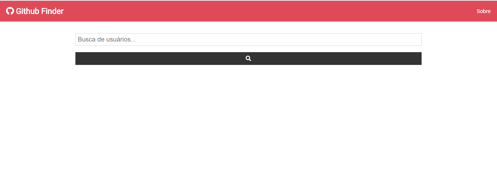
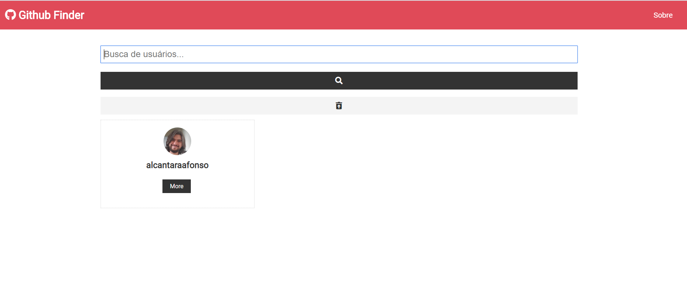
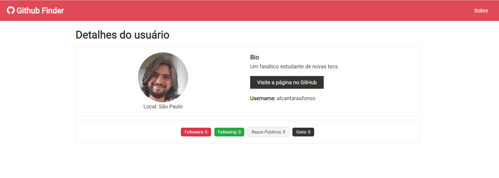

## Github Finder

Este projeto foi criado usando React 16 e Node 16. Utiliza conceitos de function componentes e hooks (useState, useEffect e useContext). Também usa um CSS próprio para criar as views  
Consome a API do próprio GitHub para buscar os usuários e suas informações básicas.

### Comandos
Instale os pacotes executando o comando `npm install`

Para executar, execute o comando `yarn start -local`

Para rodar local. 
Abrir: [http://localhost:3000](http://localhost:3000)

## live demo

[Gitfinder](https://gitfinderalcantaraafonso.netlify.com)

## O fluxo da APP é bem simples.

### View Inicial

Use a barra de pesquisa pra buscar os usuários na API do GitHub

### View de Resultados

Uma vez digitado o usuário, clique em More para ter mais detalhes do usuário

### View do usuário

Esta view apresenta os detalhes do usuário
